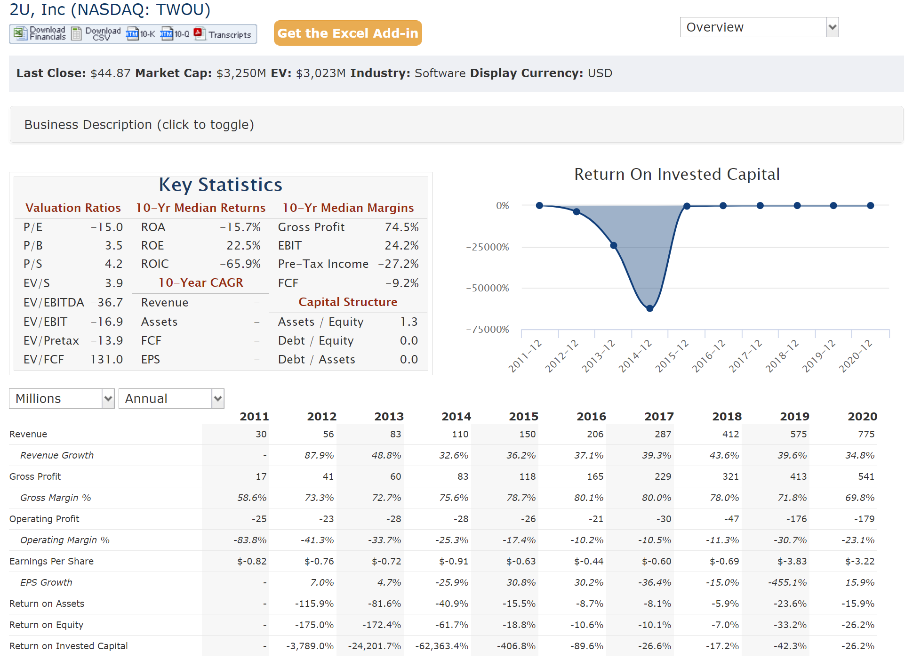
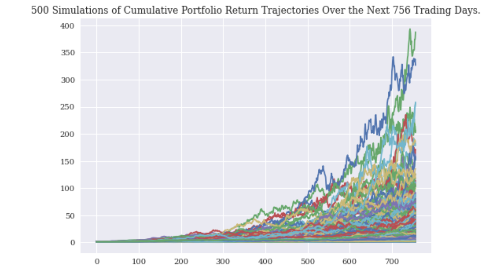
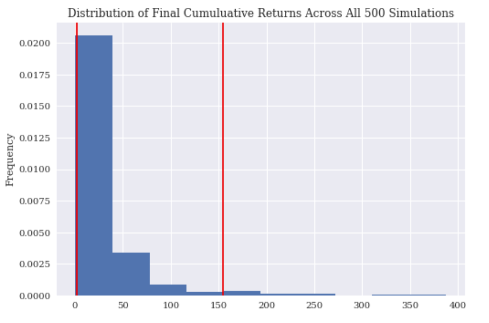

# 2U_Business_Analysis

## Background
 
2U is a online program manager. It does not confer degrees but it does provide its clients with technology and other resources to create online classes and degree programs taught by the client institution's instructors with live video and recorded classes with live video presentations. It is generally a smaller class sizes and career services is included. Students meet in a live video chat room with the professor and the other students. This business model has led to a student retention rate of 84%. 2U signs long-term contracts, typically 10-to-15 years in length, with its client institutions. Students pay standard tuition and 2U gets paid through revenue sharing.

With the acquistion of Trilogy Education Service in April 2019 for ($750mil) and right now at the time of this README the pandemic, has put 2U in a unique position more then ever. Trilogy offers non-credit professional training programs, colloquially known as coding bootcamps, through universities partners. With the the massive success Triology has had in the bootcamp space and 2U becoming the worlds largest online education provider has been a postive merege.  

---

## Tools Used 
 * Monte Carlo Sim
 * Python
 * (ALPACA) TWOU historical date

---
 
 ## Financial Anaylysis
 
 > Based on the financial information produced from [quickfs](https://quickfs.net/company/TWOU:US)  2U IPO'd in March of 2014 and have since been trying to break even on there investment. The company is now (-65.9%) ROIC in 2020, coming from a ROIC of (-62363.44%) in 2014 when they IPO'd. The average revenue growth over the 10 years is (+40%). Gross profit have just hit an all time high of ($541mil)annual or (+74.5%) growth 10yr median margins. Earnings per share is (+$3.22) and the growth rate of the EPS is (+15.9) to date. Return on Assets as of 2020 is (-15.7%). Keep in consideration the company has only been around for 13yrs, and just recently value of 2U has since gone up because of circumstance.
 
 
 
 

---

## 2u Products/Services 

> 2U is a globel leader in education technology, they are a trusted partner and brand steward of great Universities. The company has a catalog of 75 University partners and they're looking to make more partnerships within this year 2021. 2U also partners with third party platforms that helps millions or workers in America have access to affordable pathways to education from a variety of companies. 2U's main goal is to help students stay competitve throughout there lives and career with programs that go into Short Courses, Course Stacks, Boot Camps, Professional Certs, Undergraduate Degree, and Gradute Degree. Competitive edge  is that the programs are all online and price point are within reason.   

## Tools Used 
 * Monte Carlo Sim
 * Python
 * (ALPACA) 2U historical data
 
 # The Future 
 
 ##  Monte Carlo Simulation ( Range Analysis )
 
 
 >  Since 2U is a publicly traded company there is a great deal of interest in the stock price(EPS). As we look ahead to the future it would be best to understand what a possible investment of $10,000 in the stock market could yeild. Based on the Monte Carlo Simulatin Model there is a 95% chance that an initial investment of $10,000 in the portfolio over the next 3 years will end within in the range of $4247.35 and $98361.54.
 

 
 
 
